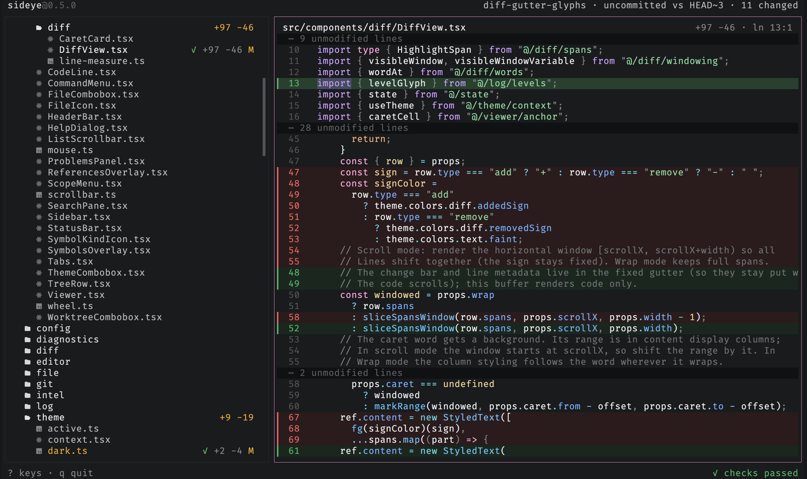
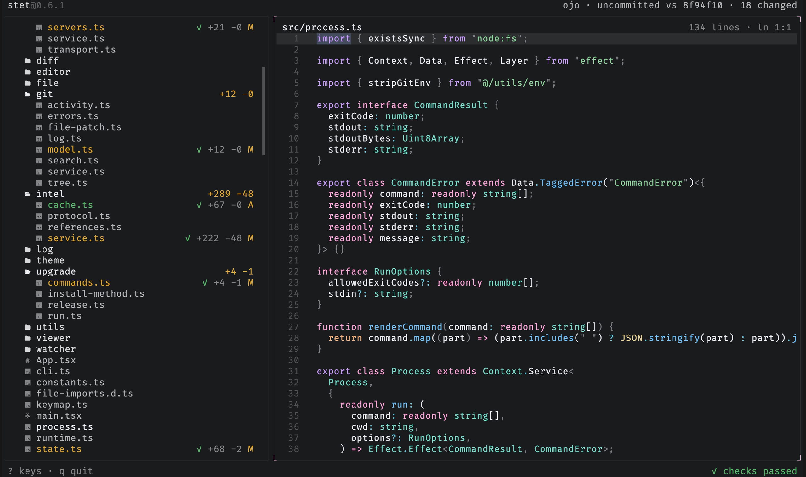
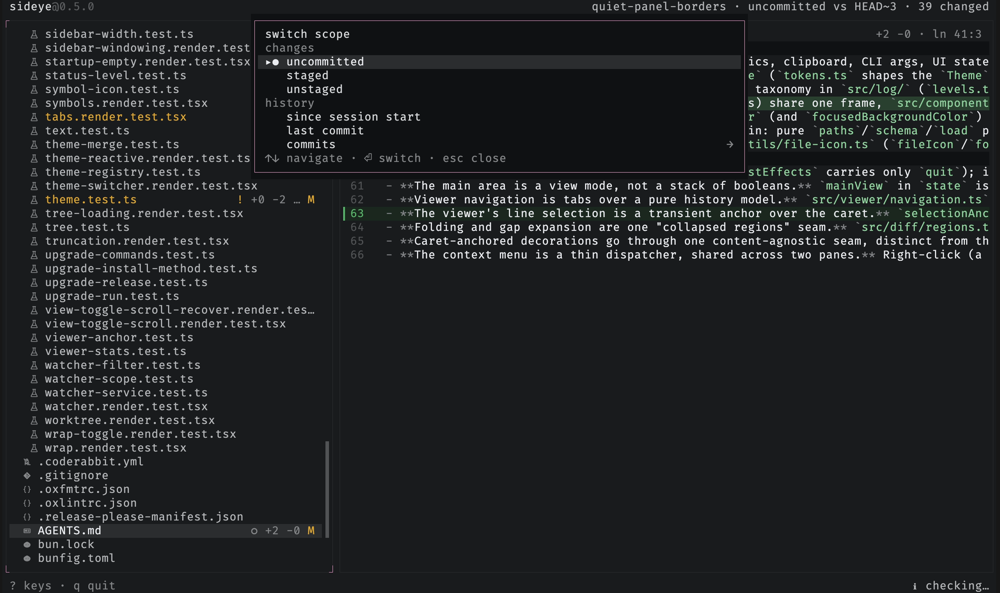
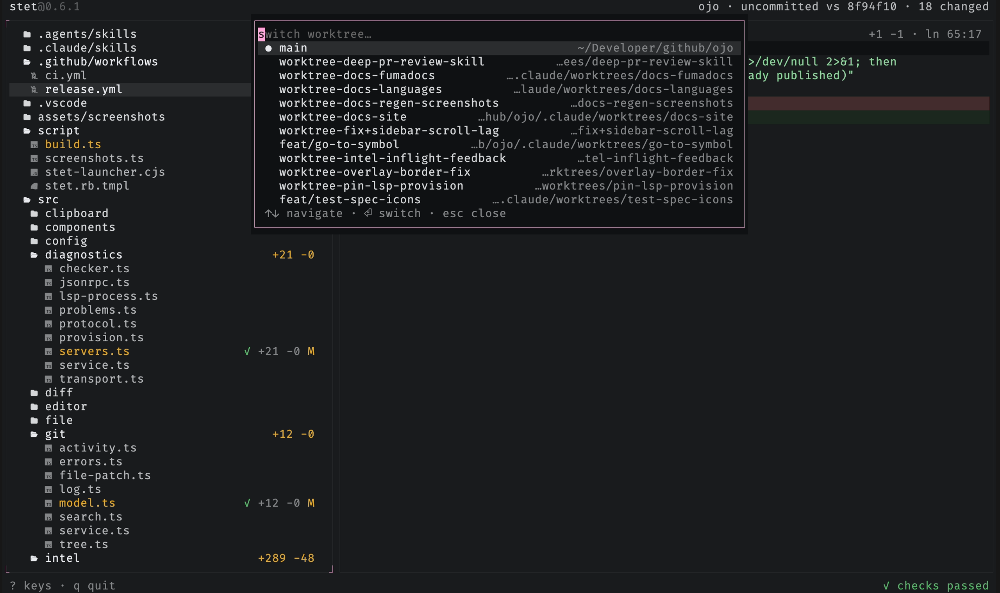
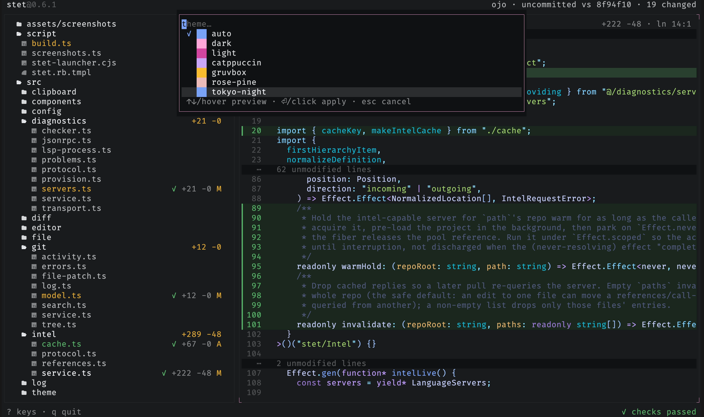
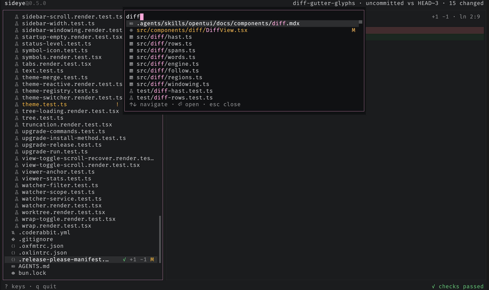
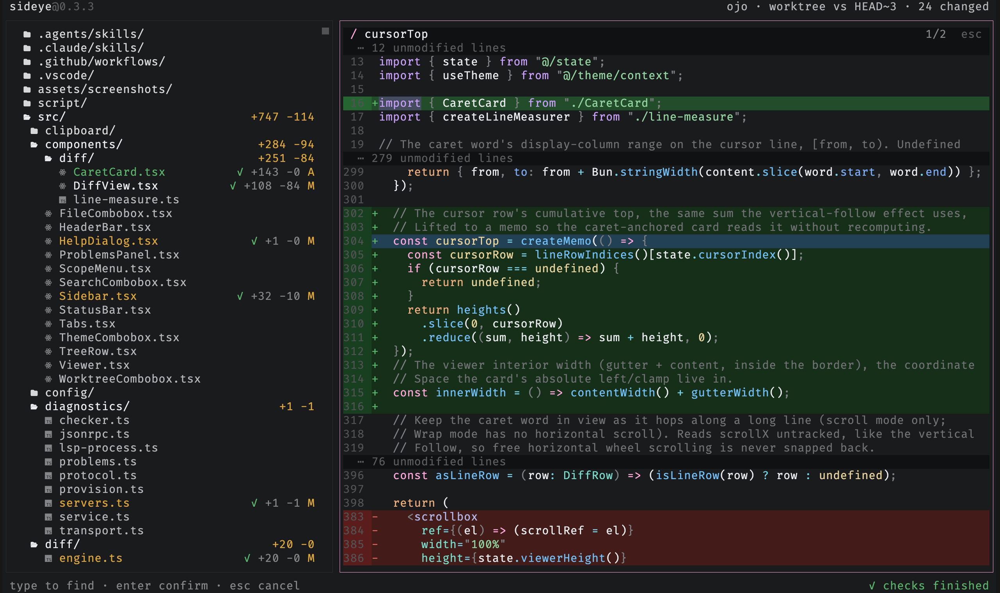
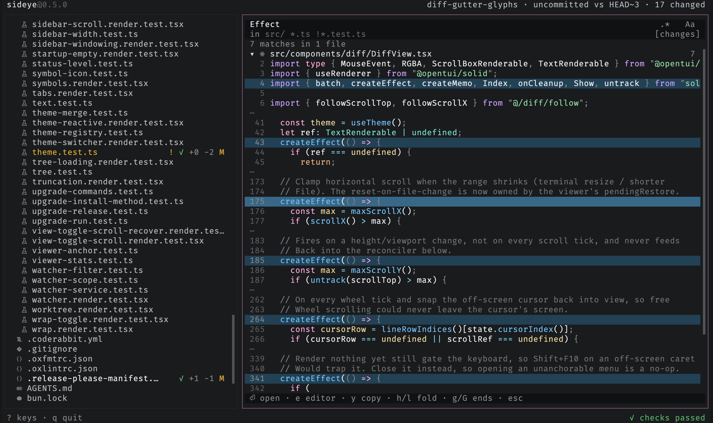
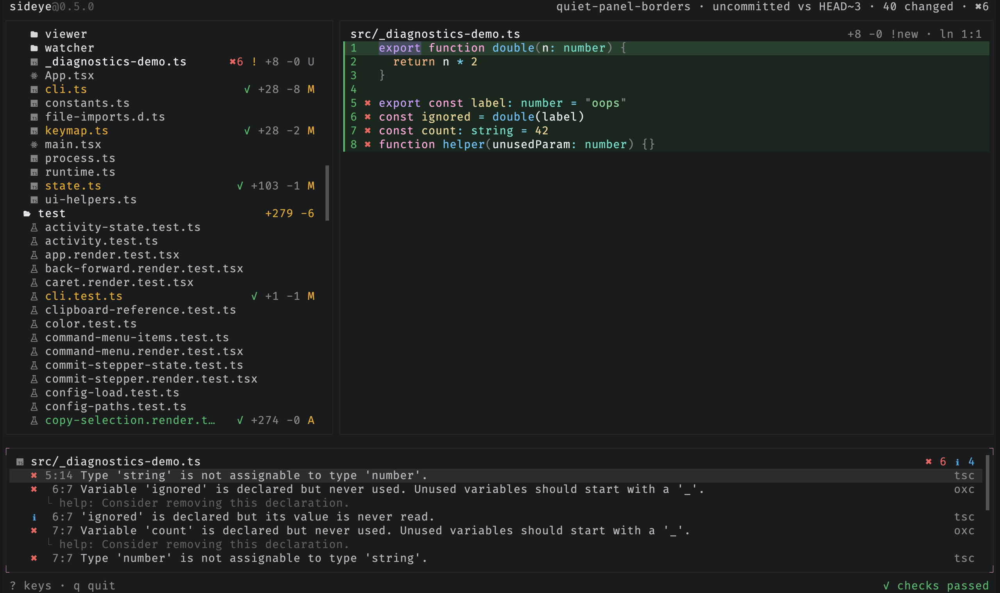
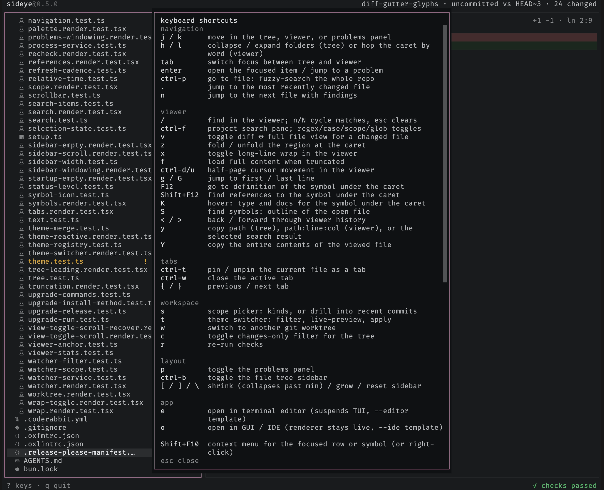

# sideye

`sideye` is a read-only terminal UI for watching a repo while a CLI coding agent
changes it.

The usual workflow is awkward. The agent is in one terminal pane, but you still
open an editor just to answer basic questions:

- What files are in this repo?
- What changed?
- What did the agent touch most recently?
- Are there errors or warnings in what changed?

`sideye` is meant to sit in the next pane and answer those questions without
becoming part of the agent loop. It does not review code, approve changes, talk
to the agent, or manage a workflow. It shows you the repo, the diff, and the
problems. You decide what to say next.



## What it does

- Shows the full repo tree, including tracked files and untracked files that are
  not ignored by git.
- Marks changed files in place, with staged, unstaged, mixed, and untracked
  states.
- Opens unchanged files read-only, with syntax highlighting for any language Shiki supports.
- Opens changed files as diffs, with a toggle for the full file.
- Finds text within the open file and cycles through the matches.
- Searches file contents across the repo, scoped to the changes or the whole
  tree.
- Switches scope from a picker: all changes, staged, unstaged, everything since
  sideye launched, or just the last commit.
- Switches between git worktrees in place, re-pointing the tree, diffs,
  refresh, and checks at the chosen worktree.
- Watches the filesystem and refreshes the moment the agent changes something,
  then keeps the current file and selection stable as the view refreshes.
- Marks recent activity and lets you jump to the latest touched file.
- Shows diagnostics in the tree, in the viewer, and in a problems panel.
- Copies a `path:line` reference and snippet so you can paste it back into the
  agent conversation.

The git-backed file tree renders first. Diagnostics come in later as decorations.
That keeps the basic view useful even when checks are still running.

## Install

```sh
# standalone binary (macOS / Linux, no runtime needed)
curl -fsSL https://raw.githubusercontent.com/jimmy-guzman/sideye/main/install.sh | bash

# npm (works with npm, bun, pnpm, yarn; pulls a prebuilt binary)
npm i -g sideye

# homebrew
brew install jimmy-guzman/tap/sideye
```

## Usage

```sh
sideye            # whole repo, worktree vs HEAD
sideye main       # compare against another ref
sideye --staged   # start in the staged scope
sideye --unstaged # start in the unstaged scope
sideye --no-icons # plain tree without Nerd Font file-type icons
sideye --wrap     # wrap long lines in the viewer instead of scrolling them horizontally
sideye --editor "nvim +{line} {file}"   # terminal editor for the e key
sideye --ide    "code --goto {file}:{line}" # GUI/IDE for the o key
```

The tree shows a file-type icon next to each file and a folder glyph for each
directory; symlinks get a distinct symlink icon and show their target path as
content (the same thing git stores), not the file they point at. These are
[Nerd Font](https://www.nerdfonts.com/) glyphs and only render with a Nerd Font
selected in your terminal; without one they appear as empty boxes, so pass
`--no-icons` to fall back to a plain tree.

## Features

### Read any file

Open any file and read it with syntax highlighting for any language Shiki
supports. Unchanged files open read-only with no diff gutters, just the source.



### Switch scope

Press `s` to pick what the diff compares: all changes, staged, unstaged,
everything since sideye launched, or just the last commit.



### Switch worktrees

Press `w` to jump between git worktrees without leaving the view. The tree,
diffs, polling, and checks all re-point at the chosen worktree.



### Switch themes

Press `t` to open the theme switcher: filter by name and move (or hover) to
preview the whole UI live, `enter` to apply, `esc` to revert. The switch lasts the
session; [config](#configuration) is where a theme is made permanent.



### Go to file

Press `ctrl-p` to fuzzy-search the whole repo and open any file.



### Find in the viewer

Press `/` to search within the open file. `n` and `N` cycle through matches, a
counter tracks your place, and `esc` clears the search.



### Search file contents

Press `ctrl-f` to search file contents across the repo. Matches show up in the
tree and the viewer, and `ctrl-a` toggles between the changed files and the
whole tree.



### Problems

Diagnostics from the repo's language servers stream into a problems panel as
checks finish: type errors from TypeScript and lint findings from oxlint, each
tagged with its source. Press `p` to open it and `enter` to jump to a finding.

No language server installed? sideye fetches one on first use (preferring the
repo's own, then your `PATH`), so diagnostics work out of the box. Pass
`--no-lsp-download` to turn that off.



## Keys

| Key         | Action                                            |
| ----------- | ------------------------------------------------- |
| `j` / `k`   | move in the tree, viewer, or problems panel       |
| `h` / `l`   | collapse / expand folders                         |
| `tab`       | switch focus between tree and viewer              |
| `enter`     | open the focused item / jump to a problem         |
| `ctrl-p`    | go to file: fuzzy-search the whole repo           |
| `/`         | find in the viewer; `n`/`N` cycle, `esc` clears   |
| `ctrl-f`    | search files; `ctrl-a` toggles changes/repo scope |
| `s`         | scope picker: unstaged/staged/all/session/last    |
| `t`         | theme switcher: filter, live-preview, apply       |
| `w`         | switch to another git worktree                    |
| `e`         | open file in terminal editor (suspends TUI)       |
| `o`         | open file in GUI / IDE (renderer stays live)      |
| `c`         | toggle changes-only filter for the tree           |
| `v`         | toggle diff <-> full file view for a changed file |
| `z`         | toggle long-line wrap in the viewer               |
| `p`         | toggle the problems panel                         |
| `b`         | toggle the file tree sidebar                      |
| `[` / `]`   | shrink / grow the sidebar (shrink past min hides) |
| `\`         | reset the sidebar to its default width            |
| `.`         | jump to the most recently changed file            |
| `n`         | jump to the next file with findings               |
| `y`         | copy focused file path, or `path:line`            |
| `f`         | load full content when truncated                  |
| `r`         | re-run checks                                     |
| `ctrl-d/u`  | half-page cursor movement in the viewer           |
| `g` / `G`   | jump to first / last line                         |
| `?`         | show all keybindings                              |
| `q` / `esc` | quit (esc closes the problems panel first)        |

Press `?` anytime to see the full list in the app:



## Mouse

The keyboard drives everything, but the mouse works too. Click a file to open
it, a folder to expand or collapse it, a diff line to move the cursor there, or
a problem to jump to it. Clicks also work in the overlays: a go-to-file or
search result, a worktree to switch to, or a theme to apply (hovering a theme
previews it live). Clicking a pane focuses it, and the wheel scrolls whichever
pane the pointer is over.

## Configuration

Optional, at `~/.config/sideye/config.jsonc` (`$XDG_CONFIG_HOME` is honored;
`config.json` also works). Without it, sideye follows your terminal's light/dark.
A malformed or invalid config never blocks startup: it falls back to defaults and
shows a notice.

Define themes under `themes` and pick one with `theme`: a single name, or a
`{ "dark": ..., "light": ... }` pair that follows the terminal live (flip your
terminal's appearance and sideye re-themes). A theme is a full set of `#rrggbb` tokens, or
`{ "base": <name>, ... }` that inherits another theme and overrides only the
tokens you name. Its `"syntax"` is a bundled Shiki theme name, or an object
overriding individual tokens (`keyword`, `string`, ...).

Use `editor` and `ide` to set persistent command templates for `e` and `o`. Both
use `{file}` and `{line}` as placeholders; `{line}` is omitted automatically
when no cursor line is available. Without a config value, each key falls back to
`SIDEYE_EDITOR` / `SIDEYE_IDE`, then `$EDITOR` / `$VISUAL`, then `vim` (editor
only); `o` does nothing if nothing is configured. A bare editor name (no
`{file}`) is expanded to a known template (`nvim` becomes `nvim +{line} {file}`,
`code` becomes `code --goto {file}:{line}`, and so on). Templates are split on
whitespace, so file paths with spaces in the editor binary path are not
supported.

```jsonc
{
  "editor": "nvim +{line} {file}",
  "ide": "code --goto {file}:{line}",
}
```

```jsonc
{
  // follow the terminal, with a custom theme on each side
  "theme": { "dark": "my-dark", "light": "my-light" },
  "themes": {
    "my-dark": { "base": "dark", "accent": { "primary": "#ffa7d9" } },
    "my-light": { "base": "light", "accent": { "primary": "#b4267a" } },
    "mocha": { "base": "dark", "syntax": "catppuccin-mocha" }, // sideye chrome, Catppuccin code
    "tweaked": { "base": "dark", "syntax": { "keyword": "#ff8800" } }, // one token changed
  },
}
```

Press `t` to open the theme switcher and try any of these without editing the
config: filter by name, move (or hover) to preview the whole UI live, `enter`
(or click) to apply, `esc` to revert. The switch lasts the session; `config` is
still where a theme is made permanent.

## Requirements

- git
- a clipboard tool for copy (`y`): `pbcopy` on macOS (built in), or `wl-copy`,
  `xclip`, or `xsel` on Linux
- a Nerd Font for the tree's file-type icons (optional; use `--no-icons` without one)

## Development

```sh
bun install
bun run src/main.tsx     # run from source
bun run check            # tests + typecheck
bun run build:dist       # build standalone binaries for all targets
```

## Non-goals

`sideye` is deliberately not an agent integration.

No approvals. No accept/reject protocol. No generated review explanation. No PR
workflow. No database. The agent never hears from `sideye`, only from you.
