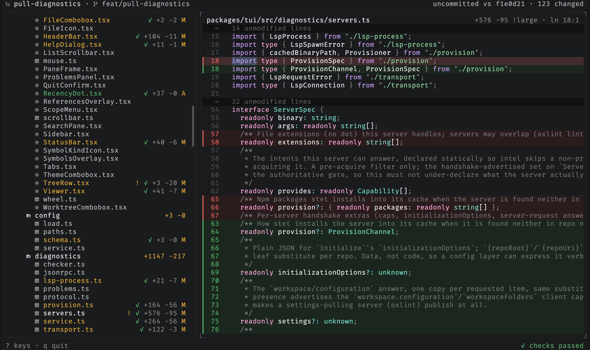

# stet

`stet` is a read-only companion TUI for inspecting an agent's changes.

The agent runs in one terminal pane, but you still open an editor just to answer
basic questions:

- What files are in this repo?
- What changed?
- What did the agent touch most recently?
- Are there errors or warnings in what changed?

`stet` is meant to sit in the next pane and answer those questions without
becoming part of the agent loop. It does not review code, approve changes, talk
to the agent, or manage a workflow. It shows you the repo, the diff, and the
problems. You decide what to say next.

Stet is the proofreader's mark for "let it stand": strike a word out, add dots
beneath, and it stays.



## What it does

- Shows the full repo tree, including tracked files and untracked files that are
  not ignored by git.
- Marks changed files in place, with staged, unstaged, mixed, and untracked
  states.
- Opens unchanged files read-only, with syntax highlighting for any language
  Shiki supports.
- Opens changed files as diffs, with a toggle for the full file.
- Finds text within the open file, and searches file contents across the repo,
  scoped to the changes or the whole tree.
- Switches scope from a picker (all changes, staged, unstaged, since launch, or
  the last commit) and between git worktrees in place.
- Watches the filesystem and refreshes as the agent changes files, keeping the
  current file and selection stable.
- Marks recent activity and lets you jump to the latest touched file.
- Shows diagnostics in the tree, the viewer, and a problems panel.
- Navigates code through read-only language-server pulls: go to definition, find
  references, find implementations, call hierarchy, hover, and a symbol outline.
- Copies a reference and snippet to paste back to the agent: `path` in the tree
  and `path:line:col` in the viewer.

The git-backed file tree renders first. Diagnostics come in later as
decorations, so the basic view stays useful even when checks are still running.

## Install

```sh
# standalone binary (macOS / Linux, no runtime needed)
curl -fsSL https://raw.githubusercontent.com/jimmy-guzman/stet/main/install.sh | bash

# npm (works with npm, bun, pnpm, yarn; pulls a prebuilt binary)
npm i -g @jimmy.codes/stet

# homebrew
brew install jimmy-guzman/tap/stet
```

Run `stet` inside any git repository; `stet upgrade` updates it in place.

## Documentation

Full documentation lives at **[stet.jimmy.codes](https://stet.jimmy.codes)**:

- [Getting started](https://stet.jimmy.codes/docs): install, usage, flags, and
  requirements
- [Guides](https://stet.jimmy.codes/docs/guides/reading-files-and-diffs):
  reading files and diffs, search and navigation, code intelligence, scopes and
  worktrees, and themes
- [Keybindings](https://stet.jimmy.codes/docs/reference/keybindings): every
  shortcut (or press `?` in the app)
- [Configuration](https://stet.jimmy.codes/docs/reference/configuration): themes
  and editor setup at `~/.config/stet/config.jsonc` (or `config.json`)

## Requirements

- git
- a clipboard tool for copy (`y`): `pbcopy` on macOS (built in), or `wl-copy`,
  `xclip`, or `xsel` on Linux
- a Nerd Font for the tree's file-type icons (optional; use `--no-icons` without
  one)

## Development

```sh
bun install
bun run stet             # run from source (the TUI lives in packages/tui)
bun run check            # tests + typecheck
bun run build:dist       # build standalone binaries for all targets
```

`bun install` also wires up git hooks (via [lefthook](https://lefthook.dev)):
`pre-commit` formats and lints staged files, `pre-push` re-runs `bun run check`.

## Non-goals

`stet` is deliberately not an agent integration. It has no approvals, no
accept/reject protocol, no generated review explanations, no PR workflow, and no
database. The agent never hears from `stet`, only from you.
