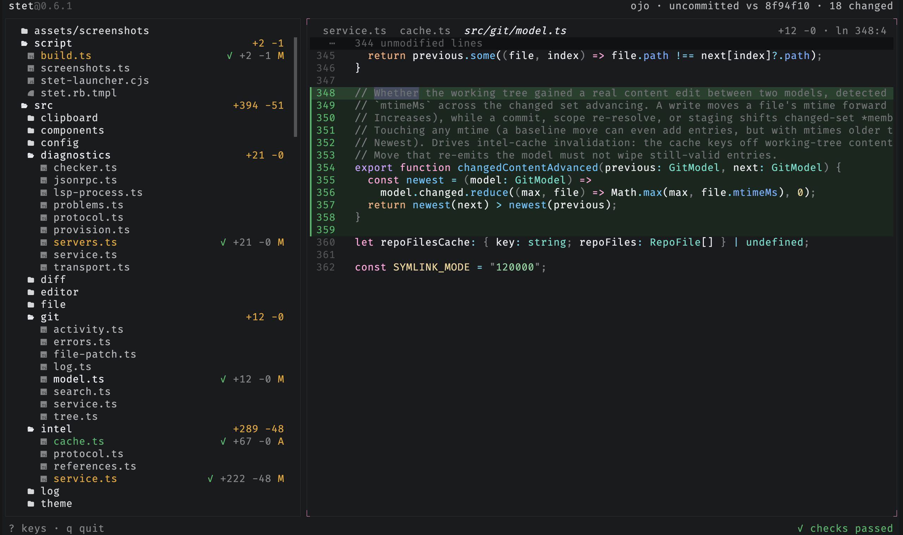
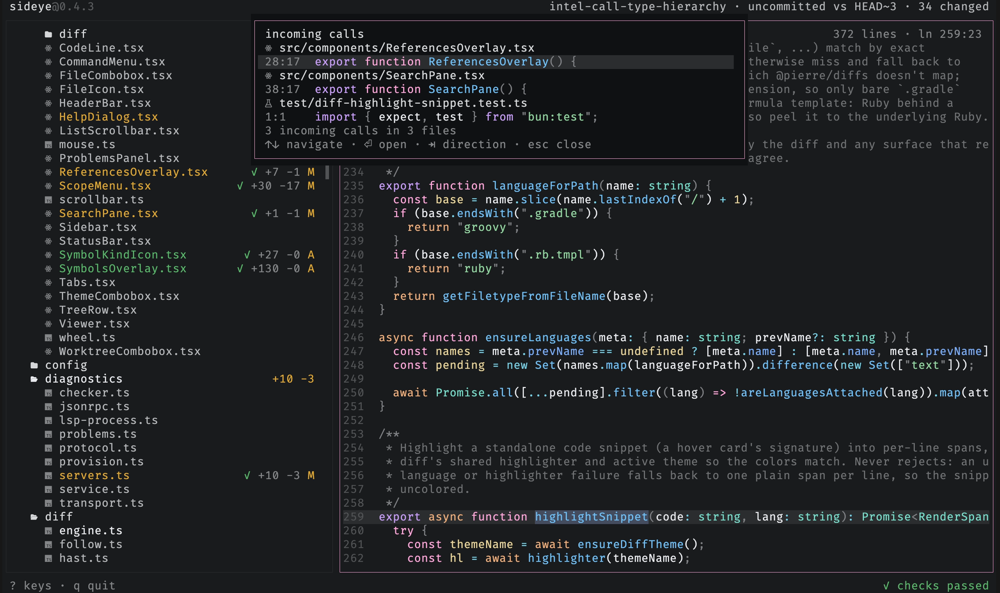
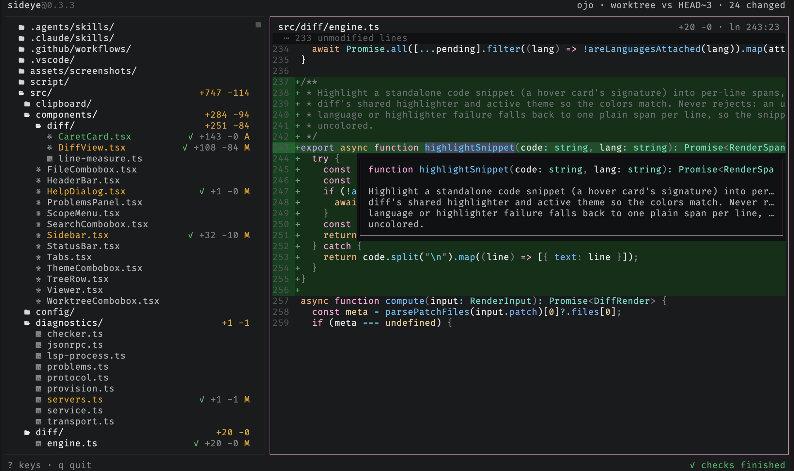
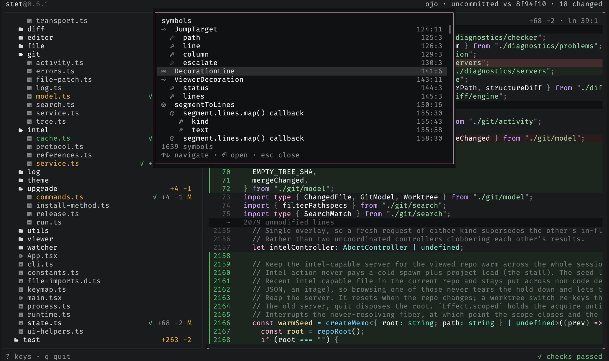

# sideye

`sideye` is a read-only companion TUI with IDE-grade insight into agent changes.

The usual workflow is awkward. The agent is in one terminal pane, but you still
open an editor just to answer basic questions:

- What files are in this repo?
- What changed?
- What did the agent touch most recently?
- Are there errors or warnings in what changed?

`sideye` is meant to sit in the next pane and answer those questions without
becoming part of the agent loop. It does not review code, approve changes, talk
to the agent, or manage a workflow. It shows you the repo, the diff, and the
problems. You decide what to say next.


## What it does

- Shows the full repo tree, including tracked files and untracked files that are
  not ignored by git.
- Marks changed files in place, with staged, unstaged, mixed, and untracked
  states.
- Opens unchanged files read-only, with syntax highlighting for any language Shiki supports.
- Opens changed files as diffs, with a toggle for the full file.
- Finds text within the open file and cycles through the matches.
- Searches file contents across the repo, scoped to the changes or the whole
  tree.
- Switches scope from a picker: all changes, staged, unstaged, everything since
  sideye launched, or just the last commit.
- Switches between git worktrees in place, re-pointing the tree, diffs,
  refresh, and checks at the chosen worktree.
- Watches the filesystem and refreshes the moment the agent changes something,
  then keeps the current file and selection stable as the view refreshes.
- Marks recent activity and lets you jump to the latest touched file.
- Shows diagnostics in the tree, in the viewer, and in a problems panel.
- Navigates code through read-only language-server pulls: go to definition, find
  references, call hierarchy, hover for type and docs, and a symbol outline of the
  open file.
- Copies a reference and snippet to paste back into the agent conversation: the
  file `path` in the tree and `path:line:col` in the viewer (`path:line` after
  clicking a line number).

The git-backed file tree renders first. Diagnostics come in later as decorations.
That keeps the basic view useful even when checks are still running.

## Install

```sh
# standalone binary (macOS / Linux, no runtime needed)
curl -fsSL https://raw.githubusercontent.com/jimmy-guzman/sideye/main/install.sh | bash

# npm (works with npm, bun, pnpm, yarn; pulls a prebuilt binary)
npm i -g sideye

# homebrew
brew install jimmy-guzman/tap/sideye
```

## Upgrade

```sh
sideye upgrade
```

Updates sideye to the latest release using whichever channel it was installed
through: a standalone install re-runs the install script, an npm install runs
npm, and a Homebrew install runs `brew upgrade`. If the install channel cannot
be determined, it prints the upgrade commands instead. It checks the latest
GitHub release first and reports `sideye X.Y.Z is already up to date` without
running anything when you are current, falling back to the channel update if it
cannot reach GitHub.

sideye also checks for a newer release in the background while it runs, and
prints a one-line notice on clean exit when one is available, the way `gh` does.
The check is non-blocking and never interrupts the session.

## Usage

```sh
sideye            # whole repo, uncommitted vs HEAD
sideye main       # compare against another ref
sideye --staged   # start in the staged scope
sideye --unstaged # start in the unstaged scope
sideye --no-icons # plain tree without Nerd Font file-type icons
sideye --wrap     # wrap long lines in the viewer instead of scrolling them horizontally
sideye --editor "nvim +{line} {file}"   # terminal editor for the e key
sideye --ide    "code --goto {file}:{line}" # GUI/IDE for the o key
```

The tree shows a file-type icon next to each file and a folder glyph for each
directory; symlinks get a distinct symlink icon and show their target path as
content (the same thing git stores), not the file they point at. These are
[Nerd Font](https://www.nerdfonts.com/) glyphs and only render with a Nerd Font
selected in your terminal; without one they appear as empty boxes, so pass
`--no-icons` to fall back to a plain tree.

## Features

### Read any file

Open any file and read it with syntax highlighting for any language Shiki
supports. Unchanged files open read-only with no diff gutters, just the source.


### Browse, go back, and pin tabs

Browsing the tree previews files in one calm view, so nothing piles up; the
preview shows in italic to mark it as ephemeral. `<` and `>` step back and forward
through where you've been, restoring each spot's cursor and scroll. When you want
to keep a file while you look at another, `ctrl-t` pins it as a tab (and `ctrl-t`
again unpins it), or double-click the tab or the file in the tree to pin it; `{` /
`}` switch tabs and `ctrl-w` closes one. Each tab carries its own history and
remembered position, and a tab's label is tinted by its diff status.



### Switch scope

Press `s` to pick what the diff compares. The scopes are grouped into changes
(uncommitted, staged, or unstaged) and history (everything since sideye launched,
or just the last commit). The picker also drills into recent commits (`commits →`),
so you can view any of them as its own diff.


### Switch worktrees

Press `w` to jump between git worktrees without leaving the view. Type to
filter by branch or path, `↑↓` to move, `⏎` to switch. The tree, diffs,
polling, and checks all re-point at the chosen worktree.


### Switch themes

Press `t` to open the theme switcher: filter by name and move (or hover) to
preview the whole UI live, `enter` to apply, `esc` to revert. The switch lasts the
session; [config](#configuration) is where a theme is made permanent.


### Go to file

Press `ctrl-p` to fuzzy-search the whole repo and open any file.


### Find in the viewer

Press `/` to search within the open file. `n` and `N` cycle through matches, a
counter tracks your place, and `esc` clears the search.


### Search file contents

Press `ctrl-f` to open the project search pane in the main viewer area. Results
group by file with syntax-highlighted context around each match; `ctrl-r`
toggles regex, `ctrl-x` toggles case sensitivity, a filter field narrows by
glob (`!` excludes, e.g. `src/ !*.test.ts`), `ctrl-g` toggles between the
changed files and the whole tree, and `ctrl-s` picks the scope without leaving
the pane. Jumping to a
match keeps your query and results, so `ctrl-f` brings them right back.


### Go to definition

Put the caret on a symbol and press `F12` to jump to its definition, backed by
the same language servers that drive diagnostics. A cross-file jump records your
spot, so `<` returns to the call site. When more than one definition matches (an
overloaded symbol), the targets open in a results list to pick from rather than
jumping to the first. It's a read-only LSP request, exactly like the diagnostics
it shares servers with: it never writes to the repo.

### Find references

Put the caret on a symbol and press `Shift+F12` to list everywhere it's used.
The results open in a palette-family overlay grouped by file, each row showing
`path:line:col` and its source line. `↑`/`↓` move, `enter` or a click jumps to a
result, `esc` closes. Same read-only LSP request family as go-to-definition,
over the same servers.

### Call hierarchy

Put the caret on a function or method and press `Shift+H` to list its callers in
the same overlay as find-references. `Tab` flips direction: incoming calls (who
calls this) to outgoing calls (what this calls) and back, the footer showing
which way you're looking. `↑`/`↓` move, `enter` or a click jumps to a caller or
callee, `esc` closes. It's a two-step read-only LSP request (prepare, then
resolve the edges), over the same servers as go-to-definition.



### Hover

Press `K` with the caret on a symbol to show its type and docs in a small card
anchored at the caret, the way an editor's hover does. The type signature is
syntax-highlighted with the same theme as the diff; the docs read as plain text.
The card clears as soon as you move the caret, scroll, switch files, or press
`esc`. It's the same read-only LSP request family as go-to-definition.



### Find symbols

Press `S` to list the open file's symbols in a palette-family overlay:
classes, functions, methods, and the rest, each with its kind icon and
`line:col`, nested to mirror the file's structure. `↑`/`↓` move, `enter` or a
click jumps to a symbol, `esc` closes. Unlike go-to-definition it needs no
caret, only an open file. Same read-only LSP request family, over the same
servers.



### Problems

Diagnostics from the repo's language servers stream into a problems panel as
checks finish: type errors from TypeScript and lint findings from oxlint, plus
Biome's diagnostics in repos that use it (a `biome.json`/`biome.jsonc`), covering
CSS and GraphQL on top of the JS/TS family. JSON (with JSONC) and YAML get
schema-aware validation in any repo (Biome only lints JSON, and only where it's
configured).
Each is tagged with its source and pinpointed to its `line:col`. Press `p` to
open it and `enter` to jump to a finding.

No language server installed? sideye fetches one on first use (preferring the
repo's own, then your `PATH`), so diagnostics work out of the box. Pass
`--no-lsp-download` to turn that off.


## Keys

### navigation

| Key       | Action                                           |
| --------- | ------------------------------------------------ |
| `j` / `k` | move in the tree, viewer, or problems panel      |
| `h` / `l` | collapse / expand folders, or word-hop the caret |
| `tab`     | switch focus between tree and viewer             |
| `enter`   | open the focused item / jump to a problem        |
| `ctrl-p`  | go to file: fuzzy-search the whole repo          |
| `.`       | jump to the most recently changed file           |
| `n`       | jump to the next file with findings              |

### viewer

| Key         | Action                                               |
| ----------- | ---------------------------------------------------- |
| `/`         | find in the viewer; `n`/`N` cycle, `esc` clears      |
| `ctrl-f`    | project search pane; regex/case/glob/scope toggles   |
| `v`         | toggle diff <-> full file view for a changed file    |
| `z`         | toggle long-line wrap in the viewer                  |
| `f`         | load full content when truncated                     |
| `ctrl-d/u`  | half-page cursor movement in the viewer              |
| `g` / `G`   | jump to first / last line                            |
| `F12`       | go to definition of the symbol under the caret       |
| `Shift+F12` | find references to the symbol under the caret        |
| `Shift+H`   | call hierarchy of the symbol (`Tab` flips direction) |
| `K`         | hover: type and docs for the symbol under the caret  |
| `S`         | find symbols: outline of the open file               |
| `<` / `>`   | back / forward through viewer history                |
| `y`         | copy `path`, `path:line`, or `path:line:col`         |
| `Y`         | copy the entire contents of the viewed file          |

### tabs

| Key       | Action                                |
| --------- | ------------------------------------- |
| `ctrl-t`  | pin / unpin the current file as a tab |
| `ctrl-w`  | close the active tab                  |
| `{` / `}` | previous / next tab                   |

### workspace

| Key | Action                                            |
| --- | ------------------------------------------------- |
| `s` | scope picker: kinds, or drill into recent commits |
| `t` | theme switcher: filter, live-preview, apply       |
| `w` | switch to another git worktree                    |
| `c` | toggle changes-only filter for the tree           |
| `r` | re-run checks                                     |

### layout

| Key       | Action                                            |
| --------- | ------------------------------------------------- |
| `p`       | toggle the problems panel                         |
| `ctrl-b`  | toggle the file tree sidebar                      |
| `[` / `]` | shrink / grow the sidebar (shrink past min hides) |
| `\`       | reset the sidebar to its default width            |

### app

| Key         | Action                                                 |
| ----------- | ------------------------------------------------------ |
| `e`         | open file in terminal editor (suspends TUI)            |
| `o`         | open file in GUI / IDE (renderer stays live)           |
| `Shift+F10` | context menu for the focused tree row or viewer symbol |
| `?`         | show all keybindings                                   |
| `q` / `esc` | quit (esc closes the problems panel first)             |

Press `?` anytime to see the full list in the app:


## Mouse

The keyboard drives everything, but the mouse works too. Click a file to open
it, a folder to expand or collapse it, a diff line to move the cursor there, or
a problem to jump to it. Double-click a file in the tree, or a tab in the strip,
to pin it as a tab. Clicks also work in the overlays and the search pane: a go-to-file result, a
worktree to switch to, or a theme to apply (hovering a theme previews it
live); a click on a search result selects it and a double-click opens it. Clicking a pane focuses it, and the wheel scrolls whichever
pane the pointer is over. Right-click a tree row or a viewer symbol for a context
menu of the actions that apply there (go to definition, find references, call
hierarchy, hover, copy, open in editor), the same menu `Shift+F10` opens on the
focused pane.

## Configuration

Optional, at `~/.config/sideye/config.jsonc` (`$XDG_CONFIG_HOME` is honored;
`config.json` also works). Without it, sideye follows your terminal's light/dark.
A malformed or invalid config never blocks startup: it falls back to defaults and
shows a notice.

Define themes under `themes` and pick one with `theme`: a single name, or a
`{ "dark": ..., "light": ... }` pair that follows the terminal live (flip your
terminal's appearance and sideye re-themes). A theme is a full set of `#rrggbb` tokens, or
`{ "base": <name>, ... }` that inherits another theme and overrides only the
tokens you name. Its `"syntax"` is a bundled Shiki theme name, or an object
overriding individual tokens (`keyword`, `string`, ...).

Use `editor` and `ide` to set persistent command templates for `e` and `o`. Both
use `{file}` and `{line}` as placeholders; `{line}` is omitted automatically
when no cursor line is available. Without a config value, each key falls back to
`SIDEYE_EDITOR` / `SIDEYE_IDE`, then `$EDITOR` / `$VISUAL`, then `vim` (editor
only); `o` does nothing if nothing is configured. A bare editor name (no
`{file}`) is expanded to a known template (`nvim` becomes `nvim +{line} {file}`,
`code` becomes `code --goto {file}:{line}`, and so on). Templates are split on
whitespace, so file paths with spaces in the editor binary path are not
supported.

```jsonc
{
  "editor": "nvim +{line} {file}",
  "ide": "code --goto {file}:{line}",
}
```

```jsonc
{
  // follow the terminal, with a custom theme on each side
  "theme": { "dark": "my-dark", "light": "my-light" },
  "themes": {
    "my-dark": { "base": "dark", "accent": { "primary": "#ffa7d9" } },
    "my-light": { "base": "light", "accent": { "primary": "#b4267a" } },
    "mocha": { "base": "dark", "syntax": "catppuccin-mocha" }, // sideye chrome, Catppuccin code
    "tweaked": { "base": "dark", "syntax": { "keyword": "#ff8800" } }, // one token changed
  },
}
```

Press `t` to open the theme switcher and try any of these without editing the
config: filter by name, move (or hover) to preview the whole UI live, `enter`
(or click) to apply, `esc` to revert. The switch lasts the session; `config` is
still where a theme is made permanent.

## Requirements

- git
- a clipboard tool for copy (`y`): `pbcopy` on macOS (built in), or `wl-copy`,
  `xclip`, or `xsel` on Linux
- a Nerd Font for the tree's file-type icons (optional; use `--no-icons` without one)

## Development

```sh
bun install
bun run src/main.tsx     # run from source
bun run check            # tests + typecheck
bun run build:dist       # build standalone binaries for all targets
```

`bun install` also wires up git hooks (via [lefthook](https://lefthook.dev)):
`pre-commit` formats and lints staged files, `pre-push` re-runs `bun run check`.

## Non-goals

`sideye` is deliberately not an agent integration.

No approvals. No accept/reject protocol. No generated review explanation. No PR
workflow. No database. The agent never hears from `sideye`, only from you.
